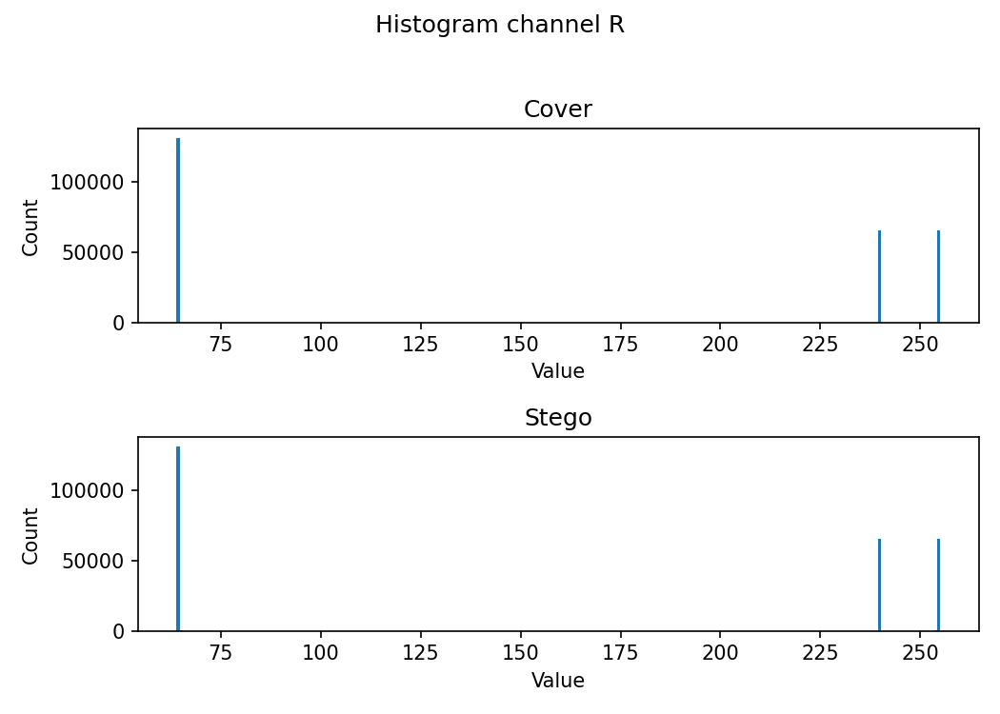
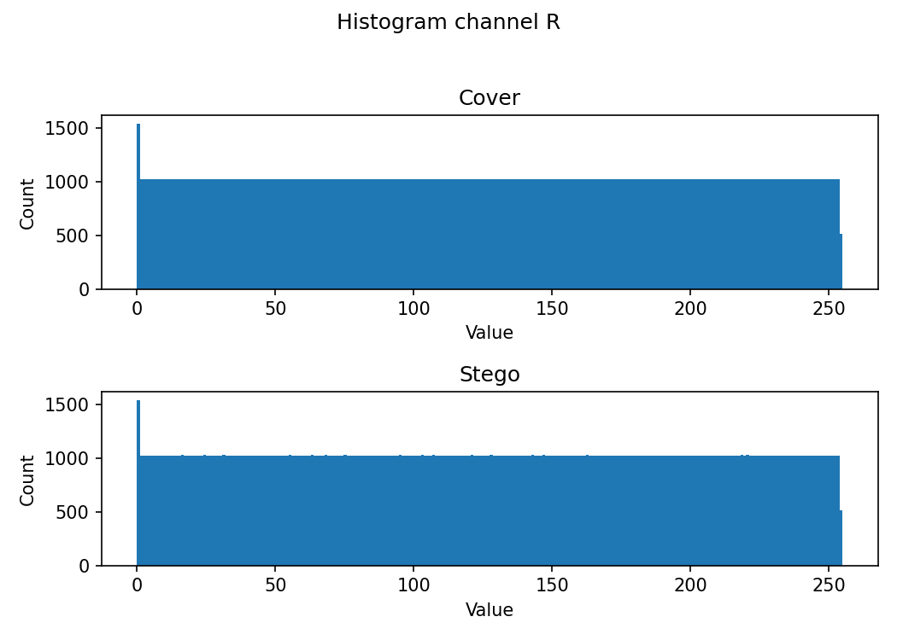
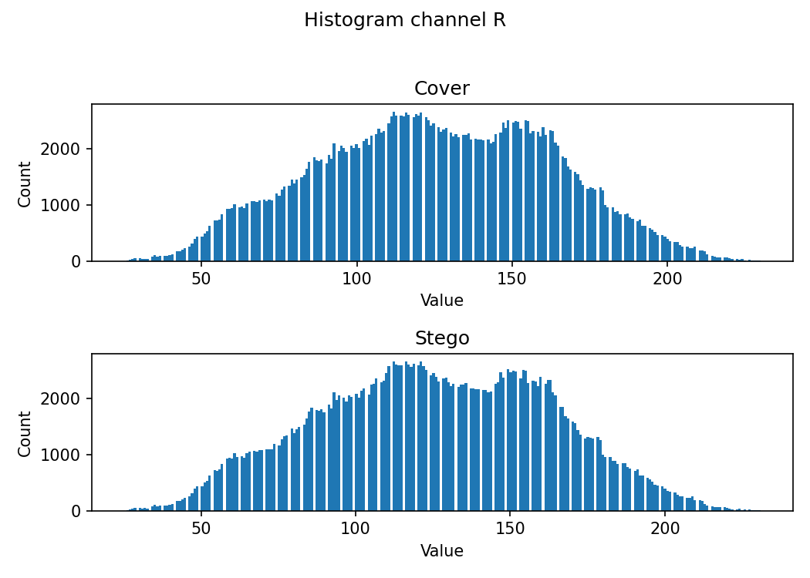
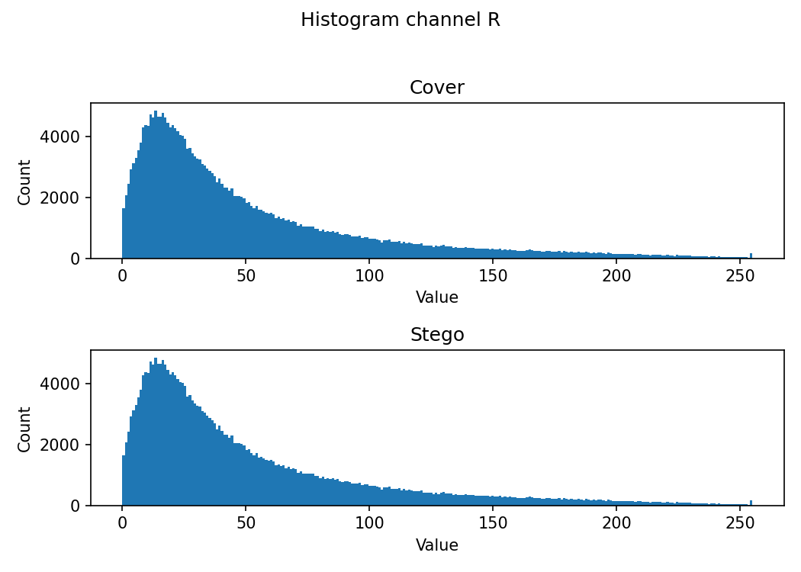
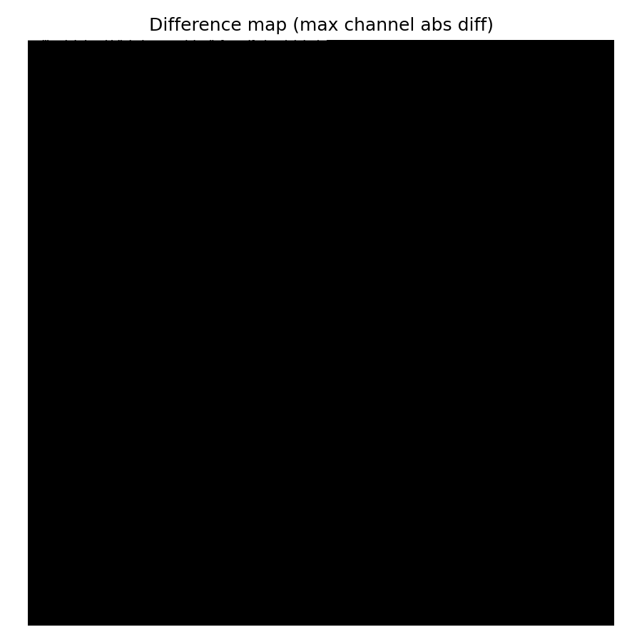
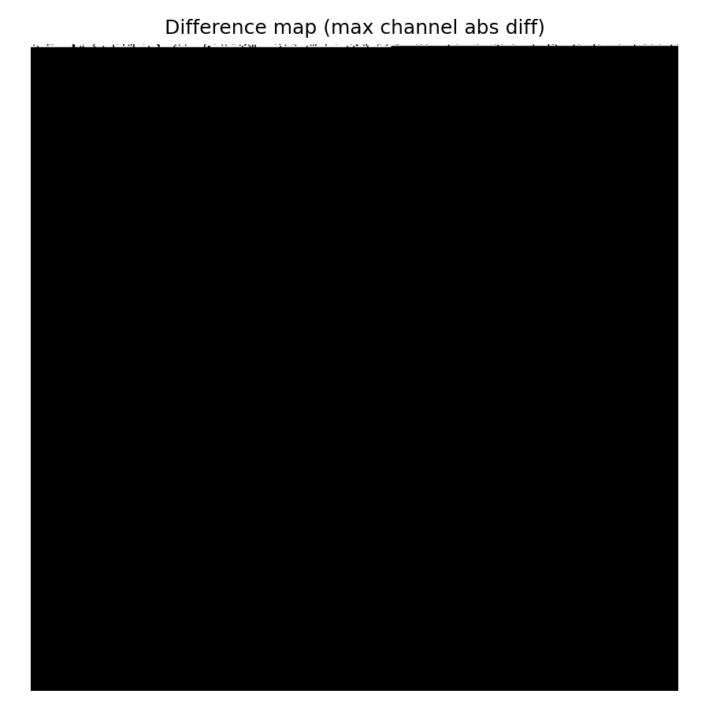
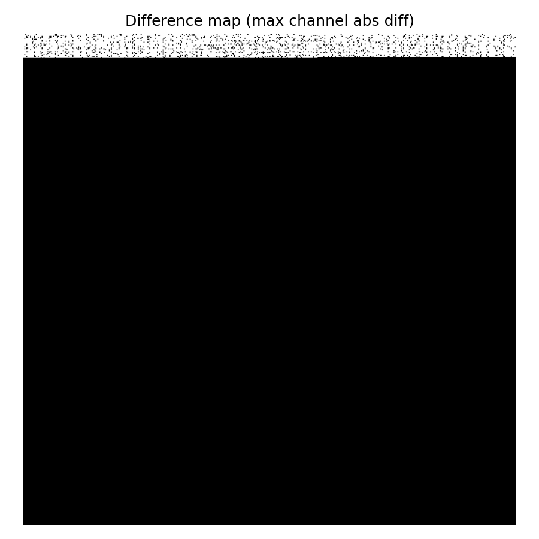
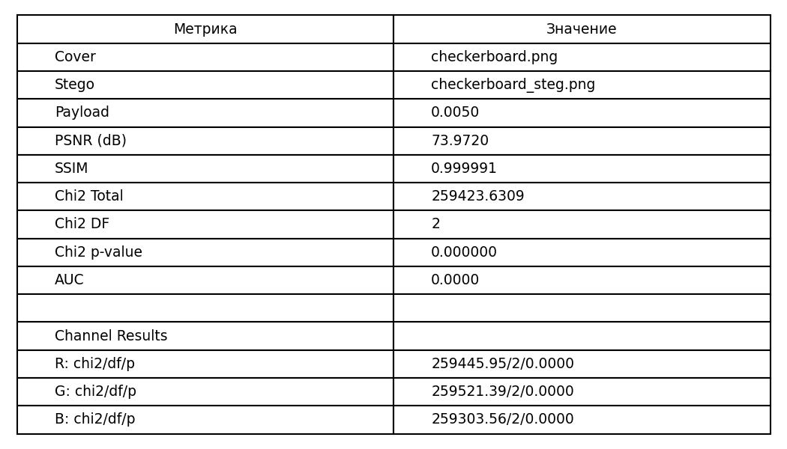
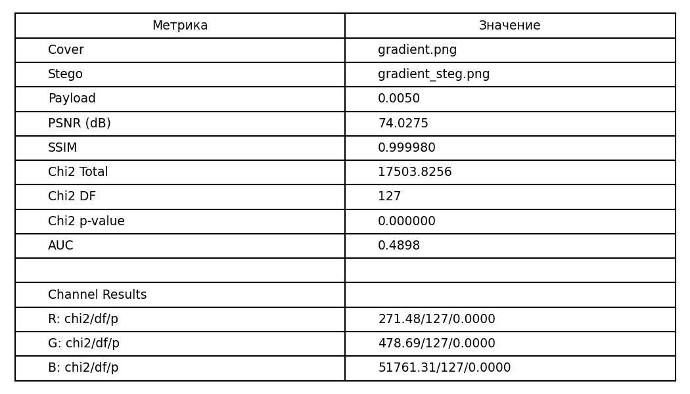
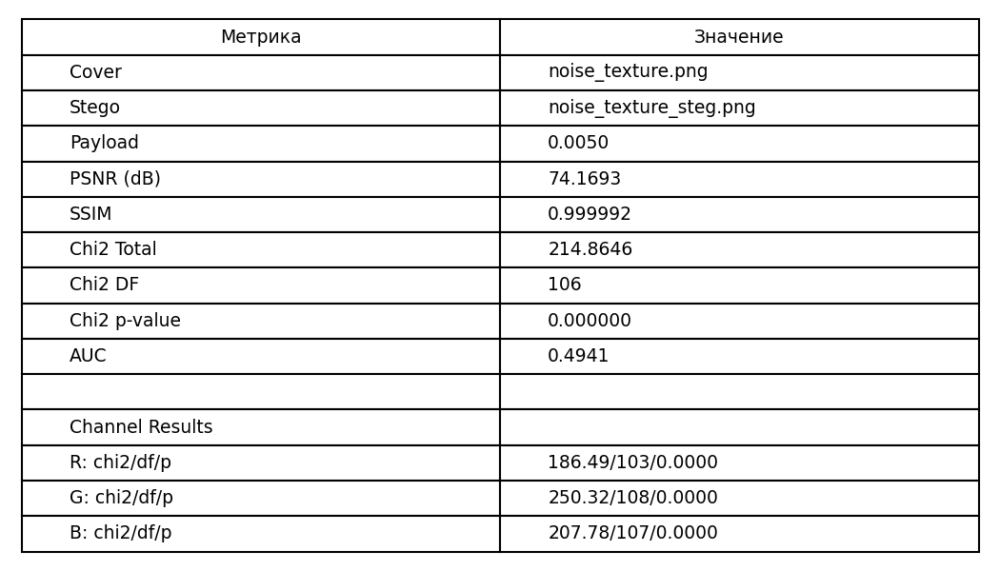

# Лабораторная 2: стеганография в изображениях (LSB)

## Метод LSB-1
В ходе выполнения данной лабораторной работы был реализован метод встраивания сообщения в изображение LSB-1. Метод заключается в изменении последнего бита байта изображения на бит сообщения. В моей работе это было реализовано следующим образом.
### Встраивание сообщения
Число 254 в двоичной системе счисления представляется как **11111110**. Для байта изображения мы проводим побитовое **И**, тем самым обнуляя младший бит байта изображения. Далее по такому же принципу мы проводим операцию **ИЛИ** с битом сообщения, встраивая его в конец байта картинки.
```python
    bits_arr = np.array([0 if ch == '0' else 1 for ch in bits], dtype=np.uint8)
    mask = np.uint8(254)
    flat[:n_bits] = (flat[:n_bits] & mask) | bits_arr
```
#### Пример:
- Побитовое **И** с маской
  ```
  Пиксель = 187 (10111011 в двоичной)
  10111011 (187) & 11111110 (254) = 10111010 (186)
  ```

- Побитовое **ИЛИ** с битом сообщения
  ```
  Бит сообщения = 1
  10111010 (186) | 00000001 (1) = 10111011 (187) 

  Бит сообщения = 0  
  10111010 (186) | 00000000 (0) = 10111010 (186) 
  ```

### Восстановление сообщения
Для восстановления сообщения мы проходимся по массиву всех битов сообщения с шагом **8**, и проводим побитовое **И** с числом 1, представленном в двоичной системе счисления как **00000001**, получая в качестве результата биты исходного сообщения.
```python
    flat = arr.flatten()
    max_bits = min(len(flat), max_chars * 8)
    bits = [str(int(flat[i] & 1)) for i in range(max_bits)]
```

#### Пример:
```
Байт пикселя: 187 (в двоичной: 10111011)
187 & 1 = 10111011 & 00000001 = 00000001 = 1 - получили бит сообщения
```

## Метрики
Для оценки качества стеганографии был проведён анализ искажений:
- **PSNR**
- **SSIM**
- Карты разности
- Гистограммы

А также анализ обнаружимости (стегоанализ):
- χ²-тест

### PSNR (Peak Signal-to-Noise Ratio)
Пиковое отношение сигнал/шум. Эта метрика показывает, насколько "зашумлено" stego-изображение по сравнению с оригиналом.
Для начала расчитывается MSE (среднеквадратичная ошибка) по формуле:
```
# Для изображений размером H × W × C:
MSE = (1/(H×W×C)) × ΣΣΣ (I_orig(i,j,k) - I_steg(i,j,k))²
```
А затем само PSNR:
```
PSNR = 10 × log₁₀(MAX² / MSE)
```
Код просчёта метрики:
```python
psnr = float(peak_signal_noise_ratio(orig, steg, data_range=255))
```
Если зачение PSNR больше 40 dB, значит искажения незаметны.

### SSIM (Structural Similarity Index)
Индекс структурного сходства. Оценивает искажение структур (линий, границ), контрастности и яркости. Показывает, насколько структурно схожи stego-изображение и оригинал.
Расчитывается по формуле:
```math
SSIM(x,y) = [l(x,y)]ᵅ × [c(x,y)]ᵝ × [s(x,y)]ᵞ
```
где **l(x, y)** - сравнение яркости ```(2μₓμᵧ + C₁) / (μₓ² + μᵧ² + C₁)```\
**c(x, y)** - сравнение контраста ```(2σₓσᵧ + C₂) / (σₓ² + σᵧ² + C₂)```\
**s(x, y)** - сравнение структуры ```(σₓᵧ + C₃) / (σₓσᵧ + C₃)``` \
\
Код просчёта метрики:
```python
h, w = orig.shape[0], orig.shape[1]
    min_side = min(h, w)
    if min_side < 7:
        win_size = min_side if (min_side % 2 == 1) else (min_side - 1)
        if win_size < 3:
            ssim = 1.0 if np.array_equal(orig, steg) else 0.0
            return psnr, float(ssim)
    else:
        win_size = 7

    ssim = structural_similarity(orig, steg, data_range=255, channel_axis=-1, win_size=win_size)
```
Чем ближе значение этой метрики к **1**, тем более схожи наши изображения.

### Карта разности
Показывает разницу между пикселями.
Расчитывается как обсолютная разница между пикселями оригинального и stego-изображений:
```
|cover − stego|
```
Код реализации:
```python
def save_diff_map(cover_path, stego_path, outpath):
    orig = np.array(Image.open(cover_path).convert("RGB"), dtype=np.int16)
    steg = np.array(Image.open(stego_path).convert("RGB"), dtype=np.int16)
    diff = np.abs(orig - steg).astype(np.uint8)
    gray_diff = np.max(diff, axis=2)
    plt.figure(figsize=(6,6))
    plt.imshow(gray_diff, cmap='gray')
    plt.title("Difference map (max channel abs diff)")
    plt.axis('off')
    plt.tight_layout()
    plt.savefig(outpath, dpi=150)
    plt.close()
```

### Гистограммы
Гистограммы показывают, сколько пикселей имеет каждое значение яркости (от 0 до 255) для каждого канала.\
После LSB-встраивания гистограмма может измениться, но лишь совсем немного. В целом форма гистограммы должна сохраниться, так как после встраивания сообщения, изображение как таковое не должно содержать видимых изменений.\
Код реализации:
```python
def save_histograms(cover_path, stego_path, outdir, base):
    os.makedirs(outdir, exist_ok=True)
    orig = np.array(Image.open(cover_path).convert("RGB"), dtype=np.uint8)
    steg = np.array(Image.open(stego_path).convert("RGB"), dtype=np.uint8)

    channels = ['R', 'G', 'B']

    for i, ch in enumerate(channels):
        fig, axes = plt.subplots(2, 1, figsize=(7, 5))
        plt.suptitle(f"Histogram channel {ch}")

        # --- Cover ---
        axes[0].hist(orig[:, :, i].ravel(), bins=256)
        axes[0].set_title("Cover")
        axes[0].set_xlabel("Value")
        axes[0].set_ylabel("Count")

        # --- Stego ---
        axes[1].hist(steg[:, :, i].ravel(), bins=256)
        axes[1].set_title("Stego")
        axes[1].set_xlabel("Value")
        axes[1].set_ylabel("Count")

        plt.tight_layout(rect=[0, 0, 1, 0.96])
        plt.savefig(os.path.join(outdir, f"{base}_hist_{ch}.png"), dpi=150)
        plt.close()
```

### χ²-тест (стегоанализ)
Этот тест анализирует выравнивание пар соседних значений в гистограмме изображения.\
Расчитывается следующим образом:
- Строятся гистограммы для каждого канала
- Рассматриваются пары значений (2k, 2k+1)
- Для каждой пары происходит расчёт по формулам:
  ```math
  e = \frac{n_{2k} + n_{2k+1}}{2}
  ```
  ```math
  \chi^2 = \sum_{k=0}^{127} \left( \frac{(n_{2k} - e)^2}{e} + \frac{(n_{2k+1} - e)^2}{e} \right)
  ```

Ключевые части кода просчёта метрики:
- Построение гистограммы
  ```python
  n_pixels = len(rgb_bytes) // 3
      hist = [0] * 256 # Создаём массив из 256 нулей
      base = channel
      # Считаем, сколько раз встречается каждое значение яркости и строим гистограмму частот
      for i in range(n_pixels):
          v = rgb_bytes[3 * i + base]  # Доступ к каналу R, G или B
          hist[v] += 1
  ```
- Хи-квадрат тест для одного канала изображения
  ```python
  def hi2_lsb_channel(rgb_bytes: bytes, channel: int):
    hist = _channel_histogram(rgb_bytes, channel)
    chi2 = 0.0
    used_pairs = 0

    # Анализ пар (2k, 2k+1)
    for k in range(0, 256, 2):
        o0 = hist[k]  # Наблюдаемая частота для 2k
        o1 = hist[k + 1]  # Наблюдаемая частота для 2k+1
        s = o0 + o1

        if s == 0:
            continue  # Пропуск пустых пар

        e = s / 2.0 

        chi2 += (o0 - e) * (o0 - e) / e + (o1 - e) * (o1 - e) / e
        used_pairs += 1

    df = max(used_pairs - 1, 1)
    return chi2, df
  ```
- Вычисление p-value:
  ```python
  def calculate_p_value(chi2_stat: float, df: int) -> float:
    return 1 - stats.chi2.cdf(chi2_stat, df)
  ```

Мы выдвигаем гипотезу о том, что наше изображение подозрительное, и там что-то зашифровано. В зависимости от вычисленного значения **p-value**, мы либо отвергаем гипотезу, либо принимаем.
- **p-value > 0.05** - статистически различий не обнаружен (гипотеза отвергается)
- **p-value < 0.05** - различия заметны (гипотеза принимается)

## Результаты подсчёта метрик
Теперь посмотрим, что же у нас в итоге получилось.

### Гистограммы
Анализ проводился для четырёх разных картинок. Посмотри гистограммы канала **R** для каждой из них.
- Шахматная доска
  
- Градиент
  
- Шум
  
- Собственное изображение
  

Как можно заметить, гистограммы для исходного и stego изображений почти не отличаются (как и должно быть).

### Карта разности
Для наглядности посмотрим карту разности градиента для четырёх разных **payload**.
- payload **0.1%**
  
- payload **0.5%**
  
- payload **1%**
  
- payload **5%**
  

Заметим, что по мере увеличения **payload** (нагрузки) увеличивается количество изменений на карте разности.

### PSNR, SSIM, χ²
Значения этих метрик посмотрим для наших четырёх изображений в результирующих таблицах.
- Шахматная доска
  
- Градиент
  
- Шум
  
- Собственное изображение
  

  Можно увидеть, что **PSNR** > 40 dB, а **SSIM** ≈ 1 для всех картинок, что говорит о незаметности встроенного сообщения.\
  А вот значение **p-value** < 0.05, из чего можно сделать вывод, что наше встроенное сообщение обнаружимо.

  


  


